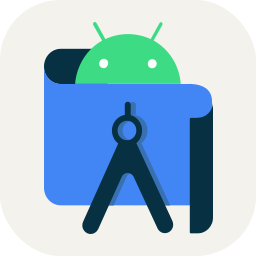

### Hi there 👋

##### A Software Developer who likes to explore various stacks of technology and develop apps for fun

#### My Interests
- Web Design
- Backend API Development
- Mobile Development
- Machine Learning

#### My Tech Stacks

 
&nbsp;
&nbsp;
&nbsp;
&nbsp;
&nbsp;
&nbsp;
&nbsp;
&nbsp;
&nbsp;
&nbsp;
&nbsp;
&nbsp;
&nbsp;
&nbsp;
&nbsp;
&nbsp;
&nbsp;
&nbsp;
&nbsp;
&nbsp;
&nbsp;

